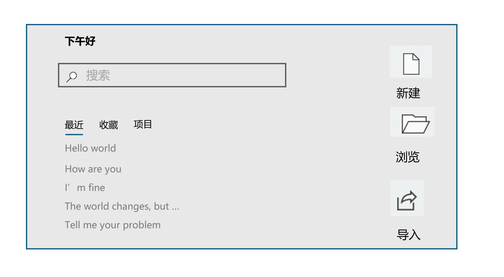

# FragmentMemory

## 介绍

随时随地，记录想法！

- 一键唤起
- 记录想法 & 搜寻想法
- 便捷分享，一键导入

## 新手教程

## 基本设计

*这部分内容面向开发者*

1. 基本UI
   - 搜索
   - 子标签
     - 最近
     - 收藏
     - 项目
     - （可添加）
   - 新建
   - 浏览
   - 导入
   
   
   
2. 存储布局

3. 搜索算法